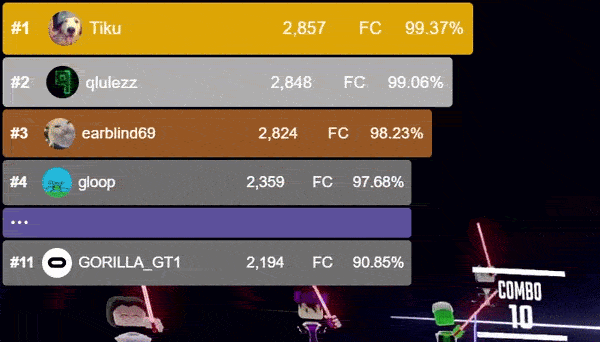

# BeatSaberPlus - Multiplayer+ Overlay for OBS

This overlay can be used in combination with the Multiplayer+ Plugin as part of BeatSaberPlus by [HardCPP](https://github.com/hardcpp).<br>
It is visually similar to the original overlay by [Hyldra Zolxy](https://github.com/HyldraZolxy), which was shut down in March of 2026.



_The code is entirely hand-written by me from scratch, no AI and no code from people not credited has been used._

## Installation

1. Add a browser source to your scene in OBS
2. Set the URL to

```
https://mpplus.qlulezz.de/

```

3. Match the resolution of the browser source to your scene (for example 1920x1080 or 1280x720)
4. The overlay will now show up whenever you join a Multiplayer+ room and hide itself when you leave the room.

## Customizations

The overlay can be visually adjusted. Changes are made through URL parameters.

Example: `https://mpplus.qlulezz.de/?position=bottom-left&scale=1.2`

The following settings are currently supported:

| Name     | Explanation                                                                                      | Default        | Example                  | Accepted values                                |
| -------- | ------------------------------------------------------------------------------------------------ | -------------- | ------------------------ | ---------------------------------------------- |
| position | The corner the overlay should go in.                                                             | top-left       | ?position=bottom-right   | top-left, top-right, bottom-left, bottom-right |
| scale    | Scaling multiplier with the origin in the specified corner.                                      | 1.0            | ?scale=1.5               | Float between 0.0 and Infinity                 |
| maxcount | Maximum player count. Will only show the top players if set at 3 or below.                       | 5              | ?maxcount=3              | Integer between 1 and Infinity                 |
| ip       | If you use a second PC to stream, write the IP address and port of the PC running the game here. | 127.0.0.1:2948 | ?ip=192.168.178.112:2948 | IP address + port                              |
| duration | The time it takes to run the animations of player ranks changing in milliseconds.                | 200            | ?duration=0              | Integer between 0 and Infinity                 |
| podium   | Styles the first three players in gold, silver and bronze colors.                                | true           | ?podium=false            | Boolean                                        |
| flash    | Makes a player flash red when the miss counter increases.                                        | true           | ?flash=false             | Boolean                                        |
| debug    | Will generate random data for testing if turned on.                                              | false          | ?debug=true              | Boolean                                        |

More settings will be added later.

## Help

Want to improve the overlay? [Let me know](https://qlulezz.de/).
